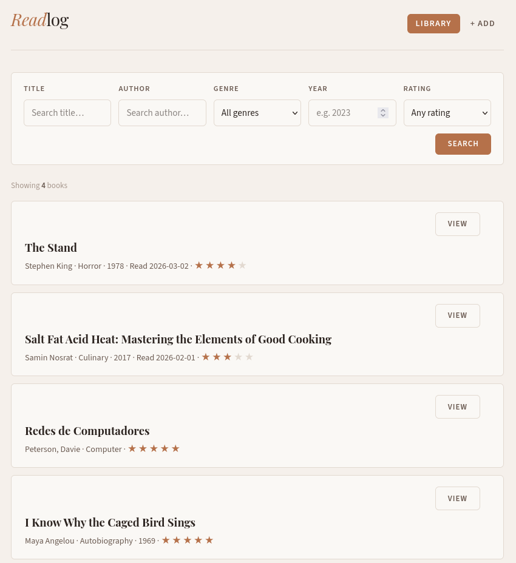
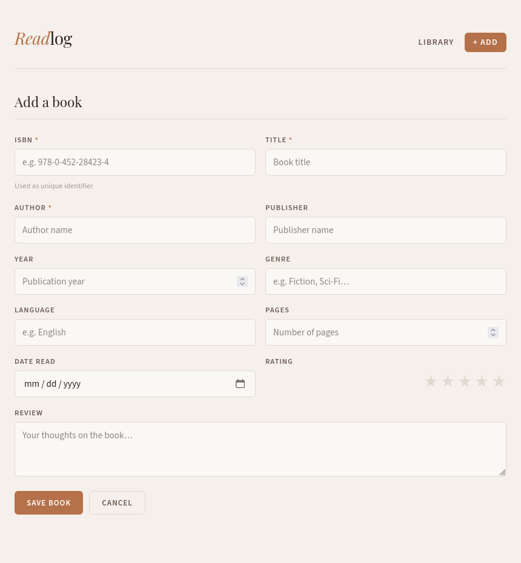
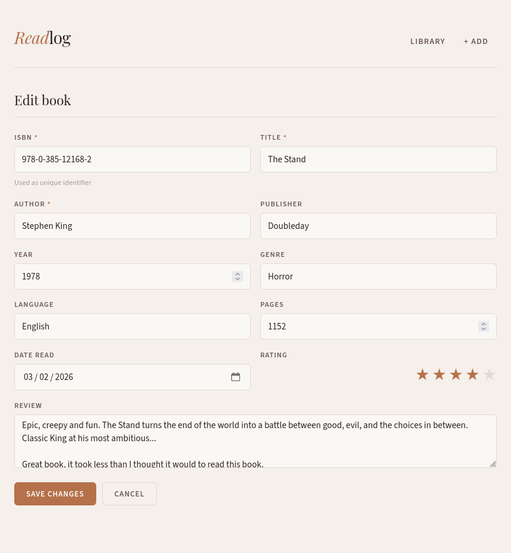

<p align="center">
  
</p>

# Readlog

A book reading tracker built with Flask and SQLite3.

## CS50x 2026 Final Project

...

---

## Setup

I recommend creating a virtual env before installing the requirements. If you are a Linux user, use the command:

```bash
python3 -m venv .venv
source .venv/bin/activate
```

Then, install the requirements (which is just flask, actually):

```bash
pip install -r requirements.txt
```

Enter the `src/` directory and run the application:

```
cd src/
python app.py
```


Open `http://127.0.0.1:5000` in your browser.

---

## Features

- Add books with ISBN, title, author, and optional metadata
- Rate and review books
- Search by title, author, genre, year, or rating
- View book details
- Delete books

---

## TODO!

- Maybe make the appearence and layout different?
- Dark option.

---


## Screenshots

### Library View


### Add Book


### Book Details


---

